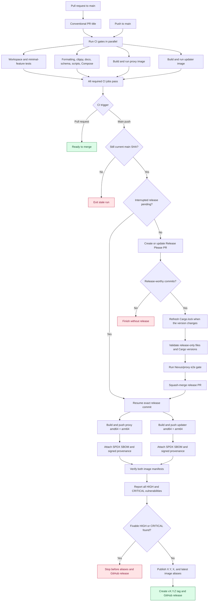

# CI and release pipeline

```mermaid
flowchart TD
    PR[Pull request to main] --> TITLE[Conventional PR title]
    TITLE --> GATES[Run CI gates in parallel]
    MAIN[Push to main] --> GATES

    GATES --> TEST[Workspace and minimal-feature tests]
    GATES --> QUALITY[Formatting, clippy, docs, schema, scripts, Compose]
    GATES --> PROXY_SMOKE[Build and run proxy image]
    GATES --> UPDATER_SMOKE[Build and run updater image]
    TEST --> CI_OK[All required CI jobs pass]
    QUALITY --> CI_OK
    PROXY_SMOKE --> CI_OK
    UPDATER_SMOKE --> CI_OK

    CI_OK --> EVENT{CI trigger}
    EVENT -->|Pull request| READY[Ready to merge]
    EVENT -->|Main push| CURRENT{Still current main SHA?}
    CURRENT -->|No| STALE[Exit stale run]
    CURRENT -->|Yes| PENDING{Interrupted release pending?}
    PENDING -->|Yes| RELEASE_COMMIT[Resume exact release commit]
    PENDING -->|No| RP[Create or update Release Please PR]
    RP --> WORTHY{Release-worthy commits?}
    WORTHY -->|No| NO_RELEASE[Finish without release]
    WORTHY -->|Yes| LOCK[Refresh Cargo.lock when the version changes]
    LOCK --> VALIDATE[Validate release-only files and Cargo versions]
    VALIDATE --> E2E[Run Nexus/proxy e2e gate]
    E2E --> MERGE[Squash-merge release PR]
    MERGE --> RELEASE_COMMIT

    RELEASE_COMMIT --> PROXY_BUILD[Build and push proxy amd64 + arm64]
    RELEASE_COMMIT --> UPDATER_BUILD[Build and push updater amd64 + arm64]
    PROXY_BUILD --> PROXY_SUPPLY[Attach SPDX SBOM and signed provenance]
    UPDATER_BUILD --> UPDATER_SUPPLY[Attach SPDX SBOM and signed provenance]
    PROXY_SUPPLY --> VERIFY[Verify both image manifests]
    UPDATER_SUPPLY --> VERIFY
    VERIFY --> REPORT[Report all HIGH and CRITICAL vulnerabilities]
    REPORT --> FIXABLE{Fixable HIGH or CRITICAL found?}
    FIXABLE -->|Yes| BLOCK[Stop before aliases and GitHub release]
    FIXABLE -->|No| ALIASES[Publish X.Y, X, and latest image aliases]
    ALIASES --> RELEASE[Create vX.Y.Z tag and GitHub release]

    classDef stop fill:#ffe4e6,stroke:#be123c,color:#881337;
    classDef success fill:#dcfce7,stroke:#15803d,color:#14532d;
    class STALE,NO_RELEASE,BLOCK stop;
    class READY,RELEASE success;
```

The workflows publish release artifacts only. They do not deploy the project.
